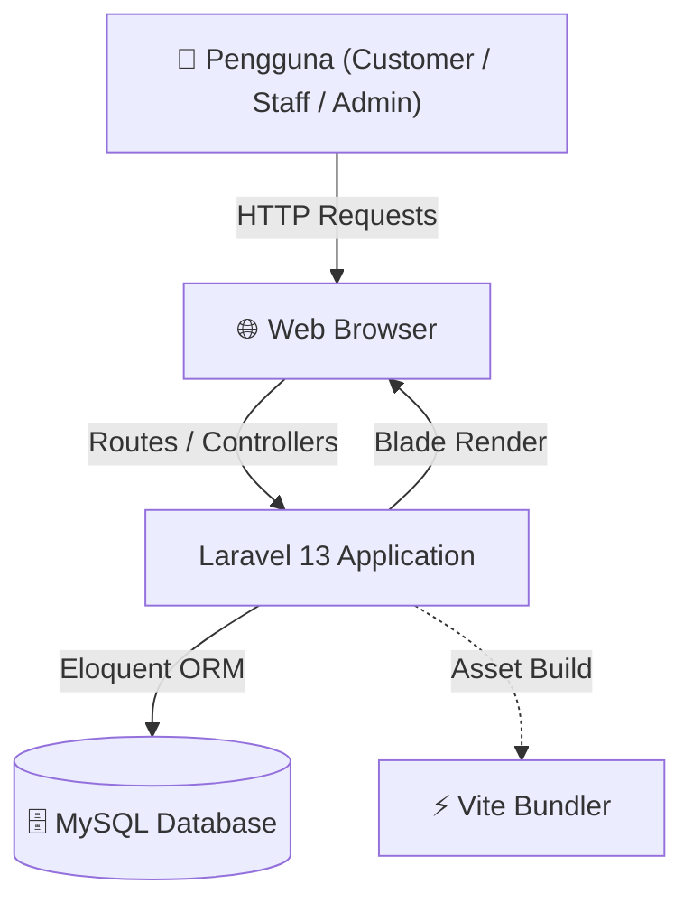
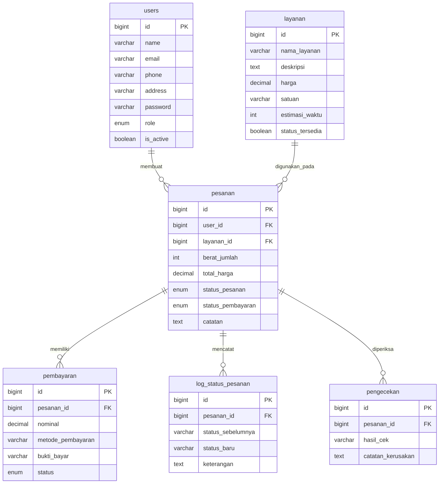

# PING! Laundry: Sistem Manajemen Laundry

<p align="center">
  <a href="http://kelas-c-6.informatika-unjedir.web.id/">
    
  </a>
  <a href="https://github.com/GervasioEl-Vasco/Project-npm-run-dev">
    
  </a>
</p>

<p align="center">
  
</p>

<p align="center">
  
  
  
  
  
  
</p>

---

## 📌 Daftar Isi
*   [ 1. Deskripsi & Masalah Projek](#1-deskripsi--masalah-projek)
*   [ 2. Fitur Unggulan (Why PING! Laundry?)](#2-fitur-unggulan-why-ping-laundry)
*   [ 3. Peran Pengguna & Fitur Sistem](#3-peran-pengguna--fitur-sistem)
*   [ 4. Matriks Implementasi Fitur (Checklist)](#4-matriks-implementasi-fitur-checklist)
*   [ 5. Arsitektur Sistem](#5-arsitektur-sistem)
*   [ 6. Struktur Direktori Utama](#6-struktur-direktori-utama)
*   [ 7. Skema & Entitas Database](#7-skema--entitas-database)
*   [ 8. Panduan Instalasi Lokal](#8-panduan-instalasi-lokal)
*   [ 9. Panduan Menjalankan Sistem](#9-panduan-menjalankan-sistem)
*   [ 10. Agile Development & Trello Workflow](#10-agile-development--trello-workflow)
*   [ 11. Dokumen Rekayasa Perangkat Lunak](#11-dokumen-rekayasa-perangkat-lunak)
*   [ 12. Informasi Proyek (Metadata)](#12-informasi-proyek-metadata)
*   [ 13. Tim Pengembang & Kontribusi](#13-tim-pengembang--kontribusi)
*   [ 14. Workflow Kolaborasi Git](#14-workflow-kolaborasi-git)
*   [ 15. Lisensi](#15-lisensi)

---

##  1. Deskripsi & Masalah Projek

### Permasalahan Nyata (Problem-First)
Berdasarkan hasil observasi pada operasional usaha laundry konvensional, ditemukan sejumlah inefisiensi krusial pada alur kerja manual:
1.  **Pencatatan Manual & Risiko Hilang:** Penggunaan nota fisik berbahan kertas rentan robek, basah, atau hilang, yang menyulitkan penelusuran histori transaksi saat pelanggan melakukan komplain.
2.  **Ketidakpastian Status Cucian:** Pelanggan tidak dapat memantau apakah pakaian mereka sedang dicuci, disetrika, atau sudah selesai, kecuali dengan mendatangi outlet laundry secara langsung atau menghubungi admin secara manual.
3.  **Potensi Selisih Keuangan:** Transaksi pembayaran kasir yang tidak tercatat secara digital seringkali memicu kesalahan rekapitulasi pembukuan bulanan bagi pemilik laundry.
4.  **Resiko Kerusakan/Kehilangan Pakaian:** Tidak adanya pencatatan kondisi awal pakaian (quality check) pada saat penyerahan laundry seringkali memicu perselisihan antara pengelola laundry dan pelanggan mengenai kerusakan pakaian yang sebenarnya sudah ada sejak awal.
5.  **Ketiadaan Laporan Terstruktur:** Pemilik laundry kesulitan memantau perkembangan omzet harian maupun mingguan karena data penjualan yang masih berserakan.

### Solusi: PING! Laundry
**PING! Laundry** adalah sistem manajemen laundry berbasis web responsif (*Responsive Web Application*) yang dirancang untuk memodernisasi tata kelola operasional dan administrasi laundry. Sistem ini dibangun dengan arsitektur monolitik yang solid menggunakan **Laravel 13** dan **Tailwind CSS** untuk menghadirkan antarmuka pengguna (UI) bertema pink premium yang menarik, bersih, serta didukung reaktivitas frontend ringan menggunakan **Alpine.js**.

Dengan PING! Laundry, pelanggan dapat membuat pesanan secara mandiri, memantau status pengerjaan, mengunggah bukti pembayaran, serta mengelola detail profil mereka. Di sisi lain, staff dan admin dapat memproses pesanan masuk, menginput hasil pengecekan awal pakaian, memverifikasi pembayaran secara transparan, serta melihat rekap laporan keuangan mingguan secara visual dan dinamis.

---

##  2. Fitur Unggulan (Why PING! Laundry?)

Dibandingkan dengan proses pengelolaan laundry konvensional, PING! Laundry menawarkan beberapa keunggulan struktural:

> [!NOTE]
> ###  Transparansi Pelacakan Status Real-Time
> Alur status pesanan terdokumentasi dengan rapi (`menunggu`, `diproses`, `selesai`, `diambil`, `dibatalkan`) beserta pencatatan riwayat perubahan status pada log sistem, meminimalisasi ketidakpastian informasi bagi pelanggan.

> [!TIP]
> ###  Pengecekan Kualitas (Quality Assurance) Terintegrasi
> Petugas laundry dapat mencatat hasil pemeriksaan fisik pakaian (Quality Check) serta mendokumentasikan catatan kerusakan awal sebelum proses pencucian dimulai untuk mencegah kesalahpahaman klaim ganti rugi.

> [!IMPORTANT]
> ###  Visualisasi Laporan Keuangan Interaktif
> Dashboard Admin dilengkapi dengan grafik performa omzet mingguan yang responsif berbasis Chart.js (CDN), memberikan gambaran pertumbuhan bisnis laundry secara cepat bagi manajemen.

---

##  3. Peran Pengguna & Fitur Sistem

Sistem ini membatasi hak akses secara ketat menggunakan middleware **Role-Based Access Control (RBAC)** yang membagi pengguna menjadi tiga peran:

### A. Customer (Pelanggan)
*   **Autentikasi Breeze Kustom:** Login dan registrasi dengan validasi input detail tambahan berupa Nomor HP aktif dan Alamat Rumah tinggal.
*   **Pemesanan Laundry Mandiri:** Form pembuatan pesanan laundry baru secara online dengan memilih jenis layanan, estimasi berat/jumlah, serta catatan tambahan.
*   **Daftar Riwayat Transaksi:** Menampilkan log semua pesanan aktif dan masa lalu beserta status pengerjaan serta metode pembayaran.
*   **Unggah Bukti Bayar:** Fitur mengunggah gambar bukti transfer pembayaran non-tunai langsung dari halaman detail transaksi.
*   **Pengaturan Akun (Profil):** Memperbarui info profil dasar, mengganti password, atau menghapus akun secara mandiri.

### B. Staff Laundry
*   **Dashboard Operasional:** Ringkasan jumlah pesanan baru, pesanan yang sedang diproses, pesanan siap diambil, dan total transaksi yang perlu penanganan.
*   **Kelola Antrean Pesanan:** Halaman visual untuk mengubah status pengerjaan pakaian (`menunggu` -> `diproses` -> `selesai` -> `diambil`).
*   **Pencatatan Hasil Cek (Quality Check):** Form input kondisi fisik pakaian dan catatan kerusakan spesifik per pesanan.
*   **Verifikasi Pembayaran:** Memeriksa bukti transfer pelanggan dan mengonfirmasi status pembayaran (berhasil/gagal).
*   **Akses Laporan:** Melihat data omzet harian dan mingguan untuk pencatatan internal toko.

### C. Admin Sistem
*   **Akses Fitur Staff:** Memiliki seluruh hak operasional yang dimiliki oleh Staff Laundry.
*   **Manajemen Pengguna Global (CRUD):** Mengelola seluruh akun pengguna di sistem (Tambah, Detail, Edit, Hapus) baik berstatus Customer, Staff, maupun sesama Admin.
*   **Dashboard Finansial:** Visualisasi grafik omzet keuangan mingguan terpadu dan widget ringkasan statistik laundry.

---

##  4. Matriks Implementasi Fitur (Checklist)

Tabel berikut menunjukkan status implementasi sesungguhnya dari fitur-fitur aplikasi berdasarkan keselarasan kode sumber (*source code*):

| Kategori | Fitur / Komponen | Status Implementasi | Deskripsi Kode |
| :--- | :--- | :---: | :--- |
| **Autentikasi** | Registrasi Akun Kustom | ✅ | `RegisteredUserController` live validation input nama, email, hp, alamat |
| **Autentikasi** | Login & Proteksi Keamanan | ✅ | Terintegrasi Laravel Breeze dengan pengalihan dashboard berdasarkan role |
| **Customer** | Pembuatan Pesanan Mandiri | ✅ | `PesananController@store` menyimpan data pesanan laundry |
| **Customer** | Riwayat & Detail Transaksi | ✅ | `OrderHistoryController` memuat data riwayat belanja pelanggan |
| **Customer** | Unggah Bukti Pembayaran | ✅ | `PembayaranController@store` mengunggah bukti bayar ke direktori penyimpanan |
| **Customer** | Kelola Data Profil | ✅ | `ProfileController` mengelola edit profil, password, dan hapus akun |
| **Staff & Admin** | Dashboard Operasional | ✅ | `dashboard.blade.php` memuat ringkasan jumlah pesanan & antrean |
| **Staff & Admin** | Kelola Status Pesanan | ✅ | `StatusPesananController` memproses pembaruan status pengerjaan laundry |
| **Staff & Admin** | Log Histori Status Pesanan | ✅ | Penambahan record log otomatis pada tabel `log_status_pesanan` |
| **Staff & Admin** | Inspeksi Kondisi Pakaian | ✅ | Form verifikasi barang input ke tabel `pengecekan` |
| **Staff & Admin** | Konfirmasi Pembayaran | ✅ | Verifikasi manual bukti transfer oleh admin/staff di `PembayaranController@konfirmasi` |
| **Staff & Admin** | Manajemen Layanan Laundry | ✅ | `LayananController` mengelola paket laundry, harga, dan satuan |
| **Staff & Admin** | Grafik Statistik Omzet | ✅ | `LaporanController` mengintegrasikan grafik omzet mingguan via Chart.js |
| **Admin** | CRUD Pengguna Sistem (RBAC) | ✅ | `UserManagementController` untuk tambah, edit, detail, dan hapus user |

---

##  5. Arsitektur Sistem

PING! Laundry mengadopsi arsitektur reaktif monolitik di mana Laravel bertindak sebagai backend penyedia data, Blade merender tampilan HTML, Tailwind CSS menangani styling premium, dan Alpine.js menambahkan interaksi frontend ringan:



---

##  6. Struktur Direktori Utama

Berikut adalah bagian-bagian penting dari kode sumber aplikasi PING! Laundry:

```text
Project-npm-run-dev/
├── app/
│   ├── Http/
│   │   ├── Controllers/
│   │   │   ├── Admin/
│   │   │   │   └── UserManagementController.php   # CRUD manajemen pengguna
│   │   │   ├── Auth/
│   │   │   │   ├── RegisteredUserController.php   # Registrasi kustom (HP & Alamat)
│   │   │   │   └── ...                            # Controller auth Breeze
│   │   │   ├── LaporanController.php              # Rekap omzet & data Chart.js
│   │   │   ├── LayananController.php              # CRUD paket/layanan laundry
│   │   │   ├── OrderHistoryController.php         # Riwayat pesanan pelanggan
│   │   │   ├── PembayaranController.php           # Validasi & konfirmasi transaksi pembayaran
│   │   │   ├── PesananController.php              # Manajemen pesanan masuk & buat pesanan
│   │   │   ├── ProfileController.php              # Manajemen profil pengguna
│   │   │   └── StatusPesananController.php        # Logika pembaruan status pesanan
│   │   └── Middleware/
│   │       └── EnsureUserHasRole.php              # Middleware RBAC (admin/staff/customer)
│   └── Models/
│       ├── User.php                               # Representasi tabel users
│       ├── Layanan.php                            # Representasi tabel layanan
│       ├── Pesanan.php                            # Representasi tabel pesanan
│       ├── Pembayaran.php                         # Representasi tabel pembayaran
│       ├── LogStatus.php                          # Representasi log_status_pesanan
│       └── Pengecekan.php                         # Representasi pengecekan kualitas
├── config/                                        # Berkas konfigurasi framework Laravel
├── database/
│   ├── migrations/                                # Migrasi skema database relasional
│   └── seeders/                                   # Data sampel (UserSeeder, LayananSeeder)
├── public/
│   └── images/                                    # Aset gambar background & logo
│       ├── bg-dashboard.png
│       ├── bg-login-reg.png
│       └── logo.png                               # Logo PING! Laundry
├── resources/
│   ├── css/
│   │   └── app.css                                # File CSS utama Tailwind
│   ├── js/
│   │   └── app.js                                 # Inisialisasi Alpine.js
│   └── views/                                     # View Blade Templates
│       ├── admin/
│       │   └── users/                             # View kelola user
│       ├── auth/                                  # View autentikasi Breeze
│       ├── components/                            # Komponen sidebar & layouting
│       │   ├── sidebar-admin.blade.php
│       │   └── sidebar-customer.blade.php
│       ├── history/                               # View detail & daftar riwayat
│       ├── laporan/                               # View grafik omzet
│       ├── layouts/                               # Base layout (app, guest)
│       ├── pesanan/                               # View buat pesanan & kelola status
│       ├── profile/                               # View edit detail akun
│       └── welcome.blade.php                      # Landing page PING! Laundry
├── routes/
│   ├── web.php                                    # Route utama aplikasi
│   └── auth.php                                   # Route otentikasi
├── tailwind.config.js                             # Kustomisasi tema warna pink premium
└── vite.config.js                                 # Konfigurasi bundler Vite
```

*File controller utama:*
- [UserManagementController.php](file:///c:/laragon/www/Project-npm-run-dev/app/Http/Controllers/Admin/UserManagementController.php)
- [RegisteredUserController.php](file:///c:/laragon/www/Project-npm-run-dev/app/Http/Controllers/Auth/RegisteredUserController.php)
- [LaporanController.php](file:///c:/laragon/www/Project-npm-run-dev/app/Http/Controllers/LaporanController.php)
- [LayananController.php](file:///c:/laragon/www/Project-npm-run-dev/app/Http/Controllers/LayananController.php)
- [OrderHistoryController.php](file:///c:/laragon/www/Project-npm-run-dev/app/Http/Controllers/OrderHistoryController.php)
- [PembayaranController.php](file:///c:/laragon/www/Project-npm-run-dev/app/Http/Controllers/PembayaranController.php)
- [PesananController.php](file:///c:/laragon/www/Project-npm-run-dev/app/Http/Controllers/PesananController.php)
- [ProfileController.php](file:///c:/laragon/www/Project-npm-run-dev/app/Http/Controllers/ProfileController.php)
- [StatusPesananController.php](file:///c:/laragon/www/Project-npm-run-dev/app/Http/Controllers/StatusPesananController.php)

*File models utama:*
- [User.php](file:///c:/laragon/www/Project-npm-run-dev/app/Models/User.php)
- [Layanan.php](file:///c:/laragon/www/Project-npm-run-dev/app/Models/Layanan.php)
- [Pesanan.php](file:///c:/laragon/www/Project-npm-run-dev/app/Models/Pesanan.php)
- [Pembayaran.php](file:///c:/laragon/www/Project-npm-run-dev/app/Models/Pembayaran.php)
- [LogStatus.php](file:///c:/laragon/www/Project-npm-run-dev/app/Models/LogStatus.php)
- [Pengecekan.php](file:///c:/laragon/www/Project-npm-run-dev/app/Models/Pengecekan.php)

*File rute utama:*
- [web.php](file:///c:/laragon/www/Project-npm-run-dev/routes/web.php)
- [auth.php](file:///c:/laragon/www/Project-npm-run-dev/routes/auth.php)

---

##  7. Skema & Entitas Database

Basis data **PING! Laundry** terdiri dari 6 entitas tabel utama di MySQL yang saling berelasi secara presisi untuk mendukung alur bisnis laundry dari pemesanan hingga pembayaran:

### Entity Relationship Diagram (ERD)



### Tabel `users`

| Kolom               | Tipe Data          | Keterangan                                |
| -------------------- | ------------------ | ----------------------------------------- |
| `id`                | BIGINT (PK, AI)    | Primary key                               |
| `name`              | VARCHAR(255)       | Nama lengkap                              |
| `email`             | VARCHAR(255)       | Email (unik)                              |
| `phone`             | VARCHAR(255)       | Nomor HP (nullable)                       |
| `address`           | VARCHAR(255)       | Alamat rumah (nullable)                   |
| `email_verified_at` | TIMESTAMP          | Waktu verifikasi email (nullable)         |
| `password`          | VARCHAR(255)       | Password (hashed)                         |
| `role`              | ENUM               | `customer`, `staff`, `admin` (default: `customer`) |
| `is_active`         | BOOLEAN            | Status aktif (default: `true`)            |
| `remember_token`    | VARCHAR(100)       | Token "Remember Me"                       |
| `created_at`        | TIMESTAMP          | Waktu dibuat                              |
| `updated_at`        | TIMESTAMP          | Waktu diperbarui                          |

### Tabel `layanan`

| Kolom              | Tipe Data          | Keterangan                                |
| ------------------- | ------------------ | ----------------------------------------- |
| `id`               | BIGINT (PK, AI)    | Primary key                               |
| `nama_layanan`     | VARCHAR(255)       | Nama jenis layanan (Cuci Kering, dll.)    |
| `deskripsi`        | TEXT               | Deskripsi layanan (nullable)              |
| `harga`            | DECIMAL(10,2)      | Harga per satuan                          |
| `satuan`           | VARCHAR(255)       | Satuan penghitungan (default: `kg`)       |
| `estimasi_waktu`   | INT                | Estimasi pengerjaan dalam hari (default: 1) |
| `status_tersedia`  | BOOLEAN            | Ketersediaan layanan (default: `true`)    |
| `created_at`       | TIMESTAMP          | Waktu dibuat                              |
| `updated_at`       | TIMESTAMP          | Waktu diperbarui                          |

### Tabel `pesanan`

| Kolom               | Tipe Data          | Keterangan                                |
| -------------------- | ------------------ | ----------------------------------------- |
| `id`                | BIGINT (PK, AI)    | Primary key                               |
| `user_id`           | BIGINT (FK)        | Relasi ke tabel `users`                   |
| `layanan_id`        | BIGINT (FK)        | Relasi ke tabel `layanan`                 |
| `berat_jumlah`      | INT                | Berat/jumlah cucian                       |
| `total_harga`       | DECIMAL(12,2)      | Total biaya pesanan                       |
| `status_pesanan`    | ENUM               | `menunggu`, `diproses`, `selesai`, `diambil`, `dibatalkan` |
| `status_pembayaran` | ENUM               | `belum_bayar`, `sudah_bayar`              |
| `catatan`           | TEXT               | Catatan tambahan (nullable)               |
| `created_at`        | TIMESTAMP          | Waktu dibuat                              |
| `updated_at`        | TIMESTAMP          | Waktu diperbarui                          |

### Tabel `log_status_pesanan`

| Kolom               | Tipe Data          | Keterangan                                |
| -------------------- | ------------------ | ----------------------------------------- |
| `id`                | BIGINT (PK, AI)    | Primary key                               |
| `pesanan_id`        | BIGINT (FK)        | Relasi ke tabel `pesanan`                 |
| `status_sebelumnya` | VARCHAR(255)       | Status sebelum perubahan (nullable)       |
| `status_baru`       | VARCHAR(255)       | Status baru setelah perubahan             |
| `keterangan`        | TEXT               | Keterangan perubahan (nullable)           |
| `created_at`        | TIMESTAMP          | Waktu dibuat                              |
| `updated_at`        | TIMESTAMP          | Waktu diperbarui                          |

### Tabel `pengecekan`

| Kolom               | Tipe Data          | Keterangan                                |
| -------------------- | ------------------ | ----------------------------------------- |
| `id`                | BIGINT (PK, AI)    | Primary key                               |
| `pesanan_id`        | BIGINT (FK)        | Relasi ke tabel `pesanan`                 |
| `hasil_cek`         | VARCHAR(255)       | Hasil pemeriksaan barang                  |
| `catatan_kerusakan` | TEXT               | Catatan kerusakan barang (nullable)       |
| `created_at`        | TIMESTAMP          | Waktu dibuat                              |
| `updated_at`        | TIMESTAMP          | Waktu diperbarui                          |

### Tabel `pembayaran`

| Kolom               | Tipe Data          | Keterangan                                |
| -------------------- | ------------------ | ----------------------------------------- |
| `id`                | BIGINT (PK, AI)    | Primary key                               |
| `pesanan_id`        | BIGINT (FK)        | Relasi ke tabel `pesanan`                 |
| `nominal`           | DECIMAL(12,2)      | Jumlah nominal bayar                      |
| `metode_pembayaran` | VARCHAR(255)       | Metode (default: `tunai`)                 |
| `bukti_bayar`       | VARCHAR(255)       | Path file bukti pembayaran (nullable)     |
| `status`            | ENUM               | `menunggu_konfirmasi`, `berhasil`, `gagal`|
| `created_at`        | TIMESTAMP          | Waktu dibuat                              |
| `updated_at`        | TIMESTAMP          | Waktu diperbarui                          |

---

## 🔧 8. Panduan Instalasi Lokal

Ikuti petunjuk di bawah ini untuk menginstal proyek di mesin lokal Anda:

### Kebutuhan Minimal Sistem
*   **PHP >= 8.3** (disarankan extension `pdo_mysql`, `mbstring`, `openssl` terinstal)
*   **Composer** >= 2.x
*   **Node.js >= 18** & **npm** >= 9.x
*   **MySQL Server >= 8.0**

### Langkah Setup Langkah-demi-Langkah

1.  **Kloning Repositori:**
    ```bash
    git clone https://github.com/GervasioEl-Vasco/Project-npm-run-dev.git
    cd Project-npm-run-dev
    ```

2.  **Instal Dependensi PHP & Frontend:**
    ```bash
    composer install
    npm install
    ```

3.  **Salin Berkas Environment:**
    ```bash
    cp .env.example .env
    ```

4.  **Konfigurasikan database lokal pada file `.env`:**
    ```env
    DB_CONNECTION=mysql
    DB_HOST=127.0.0.1
    DB_PORT=3306
    DB_DATABASE=ping_laundry
    DB_USERNAME=root
    DB_PASSWORD=your_password_here
    ```

5.  **Hasilkan Application Key & Jalankan Migrasi Data:**
    ```bash
    php artisan key:generate
    php artisan migrate --seed
    ```
    *Seeder akan membuat akun demo default:*
    *   **Admin:** `admin@pinglaundry.com` (password: `password123`)
    *   **Penjual (Staff):** `staff@pinglaundry.com` (password: `password123`)
    *   **Mahasiswa (Customer):** `customer@pinglaundry.com` (password: `password123`)

---

##  9. Panduan Menjalankan Sistem

Aplikasi membutuhkan server web Laravel dan Vite dev server aktif bersamaan agar seluruh aset terkompilasi dan sistem berjalan lancar:

### Opsi A: Eksekusi Concurrently (Instan) ⚡
Proyek ini dikonfigurasi dengan script *concurrent execution* di `composer.json` menggunakan library `concurrently`. Jalankan satu perintah di bawah ini untuk memulai seluruh server secara paralel:
```bash
composer dev
```
*Perintah di atas akan menyalakan server Laravel Serve, Queue Listener, Pail logger, dan Vite Dev Server secara otomatis.*

---

### Opsi B: Eksekusi Manual (Dua Terminal Terpisah) 🛠️
Jika Anda ingin memantau log spesifik dari masing-masing komponen:

1.  **Terminal 1 (Laravel Server):**
    ```bash
    php artisan serve
    ```
2.  **Terminal 2 (Kompilasi Aset / Vite):**
    ```bash
    npm run dev
    ```

Akses aplikasi di: **http://localhost:8000**

---

##  10. Agile Development & Trello Workflow

Pengembangan sistem PING! Laundry dikelola menggunakan kerangka kerja **Agile Scrum** dengan pembagian tugas melalui Trello Board:

```text
[ Backlog ] ──> [ To Do (Sprint) ] ──> [ In Progress ] ──> [ Testing (QA) ] ──> [ Done ]
```

*   **Sprint 1 (Fokus Pondasi & Autentikasi):**
    *   Setup repository Git & inisialisasi arsitektur Laravel Breeze & Tailwind CSS.
    *   Kustomisasi field registrasi multi-role (penambahan field HP & Alamat) (`US-001`).
    *   Pembuatan layout UI dashboard melayang (floating sidebar) premium warna pink (`US-002`).
    *   Implementasi middleware RBAC (admin/staff/customer) (`US-003`).
*   **Sprint 2 (Fokus Transaksi & Pengecekan Kualitas):**
    *   Pembuatan form pemesanan laundry baru di sisi pelanggan (`US-004`).
    *   Modul pengelolaan daftar layanan laundry oleh pengelola (`US-005`).
    *   Implementasi alur transaksi, invoice, dan upload bukti transfer (`US-006`).
    *   Sistem pengecekan kualitas barang (Quality Check) sebelum dicuci (`US-007`).
*   **Sprint 3 (Fokus Operasional & Pelaporan):**
    *   Pembuatan modul dashboard antrean pesanan staff dan admin (`US-008`).
    *   Pencatatan riwayat log perubahan status pengerjaan pakaian (`US-009`).
    *   Verifikasi dan konfirmasi pembayaran manual oleh Admin/Staff (`US-010`).
    *   Modul visualisasi rekap laporan omzet mingguan menggunakan Chart.js (`US-011`).
    *   CRUD manajemen akun pengguna terpusat khusus level Admin (`US-012`).

---

##  11. Dokumen Rekayasa Perangkat Lunak

Seluruh dokumentasi perancangan dan pengujian sistem telah disusun secara terperinci dan dapat ditelusuri pada berkas pendukung berikut:

*   **✅ Dokumen Pengujian Black-Box (Black-Box Testing):** [BLACKBOX_TESTING.md](file:///c:/laragon/www/Project-npm-run-dev/BLACKBOX_TESTING.md) — Dokumen lengkap yang memuat 59 skenario pengujian fungsional di 12 modul utama.
*   **✅ Trello Board:** [Akses Trello Kanban Board](https://trello.com/invite/b/6a36542ebf171777e1328a64/ATTIf30acc26fbe4ccb0a4f7c2fca46484ddA8574893/rencana-project-rpl)
*   **✅ Video Presentasi Projek:** [Link Video Youtube](https://youtu.be/IfQ71MlnilE)

---

##  12. Informasi Proyek (Metadata)

| Detail Metadata | Deskripsi Nilai |
| :--- | :--- |
| **Nama Proyek** | PING! Laundry - Sistem Manajemen Laundry |
| **Versi Aplikasi** | 1.0.0 (Release Candidate) |
| **Framework Utama** | Laravel 13.8 & Tailwind CSS 3.4.19 |
| **Pustaka JS & CSS** | Alpine.js 3.x, Chart.js (via CDN) |
| **Database DBMS** | MySQL Server 8.0 / MariaDB |
| **Universitas** | Universitas Jenderal Soedirman (UNSOED) |
| **Program Studi** | S1 Informatika - Fakultas Teknik |
| **Mata Kuliah** | Rekayasa Perangkat Lunak (RPL) & Pemrograman Web |
| **Dosen Pengampu** | Mochammad Agri Triansyah, S.Kom., M.Kom. |

---

##  13. Tim Pengembang & Kontribusi

| Nama Pengembang | NIM | Peran Utama | Kontribusi Utama |
| :--- | :--- | :--- | :--- |
| **Alifvia Putri Dewani** | H1D024131 | **Project Manager & Backend** | • Mengoordinasikan pembagian tugas dan progres pengembangan tim menggunakan Git dan GitHub.<br>• Merancang dan membangun routing, database schema, migration, controller, dan middleware otentikasi.<br>• Membantu proses penyusunan dokumentasi dan pengujian akhir aplikasi. |
| **Khoiri Faldi Marwan H** | H1D024105 | **Backend** | • Mengembangkan logika bisnis backend menggunakan Laravel, model, database migrations, dan seeders.<br>• Melakukan integrasi backend pada modul admin & staff serta merancang relasi entitas database. |
| **Dzikru Yunus Khabibi** | H1D024136 | **Frontend** | • Mengembangkan antarmuka (UI) premium untuk seluruh peran (Customer, Staff, Admin) menggunakan Tailwind CSS dan Alpine.js.<br>• Menyusun layout melayang (floating sidebar), panel dashboard responsif, dan layouting mobile-friendly.<br>• Mengintegrasikan form, tombol-tombol kustom, tabel dengan header pink premium, dan visualisasi grafik Chart.js. |
| **M. Zacky Makarim** | H1D024121 | **UI/UX** | • Merancang layout mock-up antarmuka pengguna dan visual branding PING! Laundry.<br>• Menyusun skenario pengujian fungsional (Black-box Testing) untuk memastikan keandalan sistem.<br>• Mendokumentasikan bug, menguji fungsionalitas CRUD manajemen pengguna, serta menulis panduan instalasi. |

---

##  14. Workflow Kolaborasi Git

Demi menjaga kualitas kode dan menghindari konflik branch (*conflict merging*), tim menerapkan workflow git yang disiplin:

1.  **Branch Utama (`main`):** Hanya berisi kode produksi yang stabil dan siap dideploy.
2.  **Branch Fitur (`feature/[Nama_Fitur]`):** Setiap pengembang membuat branch baru untuk pengerjaan fitur spesifik.
3.  **Prosedur Pull Request (PR):**
    *   Pengembang mengajukan PR ke branch `main`.
    *   Dilakukan peninjauan kode (*code review*) dan verifikasi kelayakan uji coba.
    *   Merge disetujui setelah tidak ditemukan konflik dan pengujian lulus.

---

<p align="center">
  SISTEM MANAJEMEN LAUNDRY - Universitas Jenderal Soedirman.
</p>
